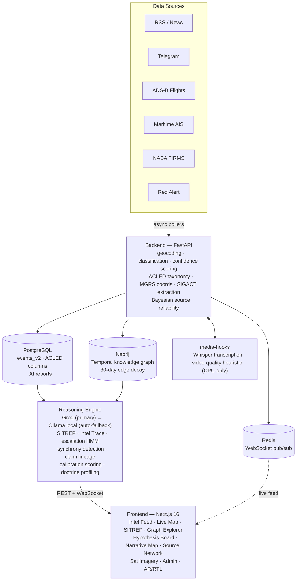

<div align="center">


# OSINT Nexus

**Autonomous all-source intelligence analyst. Never sleeps.**

[](LICENSE)
[](docker-compose.yml)
[](backend/)
[](frontend/)
[](https://doi.org/10.5281/zenodo.19169143)

</div>

---

Most dashboards show you data. OSINT Nexus **reasons** about it.

It ingests live news, Telegram channels, flight tracking, maritime AIS, active-fire satellite data, and civil defense alerts — fuses them through a Neo4j temporal knowledge graph — and runs LLM reasoning to produce structured intelligence products: SITREPs, causal chains, contradiction detection, escalation forecasts, and ranked priority actions. Watch-item tracking currently uses keyword overlap as a review aid. Analyst calibration records evidence-based outcomes; neither mechanism establishes autonomous ground-truth verification.

> Built as a production system, not a demo. Runs continuously against live open sources.

---

## The Five Layers

| Layer | What it does | Built |
|-------|-----------|:---:|
| **1. Ingestion** | RSS/news, Telegram, ADS-B flights, AIS maritime, NASA FIRMS fire detection, Red Alert civil defense, market data | ✅ |
| **2. Verification** | Multi-source corroboration, disinformation signature detection, claim-lineage fingerprinting, behavioral anomaly baselines | ✅ |
| **3. Reasoning** | Causal chains, contradiction detection, SITREP generation, escalation classification, cross-theater synchrony | ✅ |
| **4. Self-Learning** | Analyst calibration (Brier scoring), prediction-vs-reality tracking, Bayesian source reliability updates | ✅ |
| **5. Action** | Priority Action Panel, Telegram digest, ETA-scored alerts | ✅ |

---

## Intelligence Products

### Priority Action Panel
Always-visible top-3 ranked events scored by `confidence × corroboration × freshness × type_weight`. Zero clicks to reach. Every card explains itself: *"Ranked #1 because: X."* Designed to **NATO Meaningful Human Control (MHC)** standards — the system explains, the analyst decides.

### SITREP
Auto-generated situation reports every 60 minutes: what happened, why it happened, a 24h/72h/7d forward projection, and 3 specific watch items with timeframes. Confidence follows ICD 203. Watch items are compared with event text using a keyword heuristic; the displayed match score is not verified forecast accuracy.

### Intel Trace
Click any event → full causal chain from Neo4j + LLM analysis. What came before, what followed, actors involved, contradiction flags, ICD 203 confidence level. Groq (primary) with automatic local Ollama fallback on rate limits or generation failures.

### Escalation Ladder Classifier
Per-theater 6-state Hidden Markov Model (LATENT → SPORADIC → ACTIVE → ESCALATING → PEAK → DE_ESCALATING), trained directly from ingested event history — no external ACLED CSV required. Falls back to rule-based labeling when the model isn't confident.

### Cross-Theater Synchrony Detection
Detects correlated multi-theater activity using a pure-Python Fisher's exact test (one-sided, Bonferroni-corrected) over sliding windows, with per-source-pair temporal tolerances rather than one universal time bucket.

### Claim Lineage Fingerprinting
Builds a time-ordered propagation tree showing how a specific claim spread across sources — greedy closest-ancestor algorithm, hybrid time/text-distance weighting, parallel-origin detection.

### Disinformation Detector
Sliding 45-minute window across all sources. Flags coordinated information operations when the same claim appears on 3+ channels in a tight window — cosine similarity clustering on claim text, not keyword matching.

### Behavioral Doctrine Profiling
Per-actor EWMA baselines (IDF, Hamas, Hezbollah, Houthis, Russia, Ukraine) across 5 behavioral features. Flags doctrine deviations at z>2.0 (early warning) and z>3.0 (critical) — a sudden change in *how* an actor operates, not just event volume.

### Analyst Calibration Engine
Records falsifiable judgments — high-confidence star ratings, hypothesis CONFIRMED/REFUTED calls — and resolves them against ground truth (sensor corroboration, cross-source confirmation) on 24h/7d windows using Brier scores. Missing evidence remains unresolved rather than being counted as a false claim. The quality of these proxy outcomes still needs human validation.

### Hypothesis Board
A structured analytic reasoning workspace: OPEN → CONFIRMED / REFUTED / SUSPENDED kanban, ICD 203 confidence slider, evidence attached directly from the live feed, analyst notes exported in ICD 203 format.

### Narrative Cartography & Source Network Mapping
A force-directed propagation graph of how a narrative moved between channels, and a separate co-occurrence heatmap of which sources cluster together in disinfo events — both computed in pure Python/SVG, no D3 or networkx dependency.

### Satellite Imagery Scene Comparison
Before/after Sentinel-2 scene comparison for any coordinate — one click from a FIRMS fire event. Compares scene availability and cloud-cover metadata for manual review. Pixel-level change detection and smoke identification are not implemented.

### SIGACT Pattern Extraction
Regex-based extraction of MGRS grids, call signs, BDA, ZULU timestamps, weapons, and bearing/distance from raw text, with automatic sensor corroboration (FIRMS/ADS-B within 500m/30min) boosting confidence when three independent sources agree.

### Temporal Replay Engine
Scrub back to any point in time and see exactly what the intelligence picture looked like then — every panel (events, alerts, SITREP, sources) replays from that timestamp.

### Press Brief Analyzer
Paste any press conference transcript → structured extraction: headline, key claims, threats, military signals, observed facts vs. inference, follow-up recommendations.

---

## Architecture



A dedicated `media-hooks` service handles Whisper transcription and a non-forensic video-quality heuristic for ingested video, kept as a separate container so it can run CPU-only on hosts without a GPU.

---

## Tech Stack

**Backend**
- Python 3.11 · FastAPI · psycopg3
- Neo4j — temporal knowledge graph with automatic edge decay and entity disambiguation
- PostgreSQL + PostGIS
- Redis — WebSocket pub/sub
- Groq API (primary) with local Ollama fallback for rate limits and generation failures
- `hmmlearn` for escalation classification; disinformation clustering, Fisher's exact test, and narrative graphs are pure Python — no scipy/networkx dependency

**Frontend**
- Next.js 16 App Router · TypeScript · Tailwind CSS
- MapLibre GL — conflict zone overlays, event markers, MGRS grid
- Radix UI · WebSocket real-time feed

**Infrastructure**
- Docker Compose — core app (7 services) plus an optional production profile (Caddy reverse proxy, Grafana/Prometheus/Loki observability, automated backups)
- WebAuthn / Passkey authentication with TOTP and break-glass admin recovery
- Role-based access control: viewer / analyst / admin
- CI/CD via GitHub Actions — builds both images and runs the backend test suite against an isolated database on every push

---

## Getting Started

### Prerequisites
- Docker + Docker Compose
- Groq API key ([free tier](https://console.groq.com)) — or run fully offline with a local Ollama install (see `docker-compose.override.yml` for an Apple Silicon example)

### Setup

```bash
git clone https://github.com/rjaada/OSINT-NEXUS.git
cd OSINT-NEXUS
cp .env.example .env
# Add your GROQ_API_KEY and credentials to .env
docker compose up -d
```

App available at `http://localhost:3000`.

### Key Environment Variables

```env
# Required
POSTGRES_PASSWORD=your_password
NEO4J_PASSWORD=your_password
AUTH_SECRET=your_min_32_char_secret
AUTH_DEFAULT_ADMIN_USER=admin
AUTH_DEFAULT_ADMIN_PASSWORD=your_password

# Optional — LLM reasoning (falls back to local Ollama if unset/rate-limited)
GROQ_API_KEY=your_key

# Optional — live flight / maritime / fire ingestion
ENABLE_ADSBLOL=1
ENABLE_AISSTREAM=1
AISSTREAM_API_KEY=your_key
ENABLE_FIRMS=1
FIRMS_MAP_KEY=your_key

# Optional — Telegram digest (sends SITREP daily at 06:00 UTC)
TG_DIGEST_TOKEN=your_bot_token
TG_DIGEST_CHAT_ID=your_chat_id
```

Full variable reference: see `.env.example`.

---

## Pages

| Route | What It Is |
|-------|-----------|
| `/v2` | Mission Hub — dedicated workspaces for live ops, alert triage, and source verification |
| `/v2/operations` | Live intel feed, real-time map, Priority Action Panel |
| `/v2/alerts` | Confidence & ETA board — scored alerts with chain status |
| `/v2/sources` | Source reliability desk — lag, quality scores, per-source metrics |
| `/v2/briefs` | Cinematic intelligence brief sequence with PDF export |
| `/v2/sitrep` | AI situation reports — causal chain, contradictions, watch items, forecast |
| `/v2/press-brief` | Press conference transcript analyzer |
| `/v2/graph` | Neo4j knowledge graph explorer — filter by relationship type and time range |
| `/v2/narrative` | Narrative propagation map + claim lineage tree |
| `/v2/network` | Source co-occurrence network — disinformation cluster mapping |
| `/v2/hypotheses` | Analyst hypothesis board with evidence attachment |
| `/v2/imagery` | Sentinel-2 scene and cloud-metadata comparison |
| `/v2/card` | Interactive 3D operator access card |
| `/v2/health` | System health — PostgreSQL, Redis, watchdog, queue stats |
| `/v2/admin` | User role management, passkey enrollment, dynamic conflict zone editor |
| `/v2/ar/...` | Full Arabic RTL interface mirroring the core v2 pages |

---

## Security

- **WebAuthn / Passkey** — hardware key enrollment for admin accounts, with TOTP and a break-glass emergency code as bootstrap/recovery paths
- **CSRF protection** on all state-changing endpoints
- `httponly` + `SameSite` session cookies, `Secure` by default
- **Role-based route protection** across all admin and analyst-tier endpoints
- **Audit log** on all admin actions
- SHA-256 event IDs
- Startup validation — backend refuses to start with a weak `AUTH_SECRET` or default credentials
- TOTP (time-based OTP) required for analyst and admin roles
- Content-Security-Policy headers
- Backend CI runs the full auth test suite against a genuinely isolated database on every push — never against production data

---

## Data Sources

| Source | Type | Reliability Weight |
|--------|------|--------------------|
| BBC News · Reuters · AFP · Al Jazeera | RSS | 90–95 |
| Jerusalem Post · Haaretz · Times of Israel | RSS | 75–85 |
| AJ Mubasher · Roaa War Studies (TG) | Telegram | 55–70 |
| ADSB.lol | Flight tracking (sensor) | 95 |
| AISStream | Maritime AIS (sensor) | 95 |
| Red Alert (Tzeva Adom) | Civil defense (official) | 95 |
| NASA FIRMS | Active fire (sensor) | 90 |

Source weights are dynamic — analyst ratings on Intel Trace feed back into per-source reliability scores via Bayesian update. Gold, WTI, Brent, DXY, and S&P 500 are polled every 5 minutes as contextual market signals.

---

## Analytic Standards

| Standard | Implementation |
|----------|---------------|
| **ICD 203** | 4-level confidence scale (HIGH / MODERATE / LOW / VERY LOW) on all AI products |
| **NATO 2×6** | Source reliability (A–F) + claim credibility (1–6) badge on every event card |
| **ACLED taxonomy** | Full event schema compatibility — `acled_event_type`, `acled_sub_event_type`, `civilian_targeting` (structural, not keyword-based), `geo_precision`, `time_precision` |
| **NATO MHC** | Every ranked recommendation shows its reasoning. The analyst suppresses; the system never decides alone. |

---

## Research

Built on techniques from 20+ academic and practitioner sources. Peer-reviewed preprint available on Zenodo:

> **OSINT Nexus: A Production-Deployed Multi-Source Intelligence Fusion System with LLM Reasoning and Adaptive Confidence Calibration**
> Rachid Jaada, 2026 — [https://doi.org/10.5281/zenodo.19169143](https://doi.org/10.5281/zenodo.19169143)

Key references: ACLED methodology · NATO HFM-377 · DARPA EMHAT · Endsley (1995) · Flashpoint Ukraine · Recorded Future · Bellingcat

---

## Repository Layout

```
.
├── backend/
│   ├── main.py                  # FastAPI app, routes, WebSocket, background loops
│   ├── ingestion.py              # Geocoding, classification, event normalization
│   ├── pollers.py                # RSS, Telegram, ADS-B, Red Alert, SITREP pollers
│   ├── reasoning_engine.py       # SITREP, causal chain, contradiction detection
│   ├── escalation_classifier.py  # 6-state HMM escalation ladder per theater
│   ├── theater_synchrony.py      # Cross-theater correlation (Fisher's exact test)
│   ├── claim_lineage.py          # Claim propagation tree fingerprinting
│   ├── disinfo_detector.py       # Coordinated info-op signature detection
│   ├── doctrine_profiler.py      # Per-actor EWMA behavioral baselines
│   ├── calibration_engine.py     # Brier-score analyst judgment tracking
│   ├── prediction_tracker.py     # Heuristic SITREP watch-item text matching
│   ├── sigact_extractor.py       # MGRS/callsign/BDA pattern extraction
│   ├── source_network.py         # Source co-occurrence + community detection
│   ├── sentinel_imagery.py       # Sentinel-2 before/after change detection
│   ├── baseline_monitor.py       # EWMA anomaly detection per source
│   ├── graph_store.py            # Neo4j temporal knowledge graph
│   ├── v2_store.py               # PostgreSQL persistence + ACLED field mapping
│   ├── groq_client.py            # Groq + Ollama LLM client with fallback
│   ├── command_intelligence.py   # Command snapshot / decision-gap synthesis
│   └── market_poller.py          # Gold, WTI, Brent, DXY, S&P 500
├── frontend/
│   └── app/v2/                   # Next.js App Router pages (see Pages table above)
├── k8s/                          # Kubernetes manifests
├── scripts/mac-setup.sh          # Apple Silicon local dev setup (native Ollama)
├── docker-compose.yml
├── docker-compose.override.yml   # Local Apple Silicon dev overrides
├── Makefile
└── README_K8s.md
```

---

## Status

Active development. Designed for continuous live ingestion, not a fixed demo dataset — event counts, graph size, and source connectors grow with uptime. Research preprint published March 2026.

---

## License

[AGPL v3](LICENSE) — free for open use. Commercial deployments require a separate license.

---

<div align="center">

Built by [Rachid Jaada](https://github.com/rjaada)

</div>
